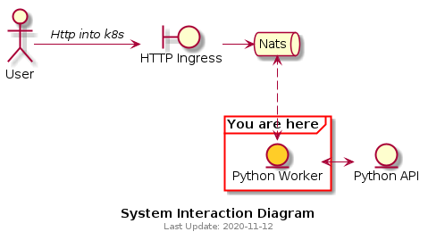

# Python (Sleepy) Worker

## Summary
Python worker's job is to subscribe to NATS subjects and act accordingly.



## Subjects

| NATS subject | Behaviour |
|---|---|
|foobar|*sleeps for whatever was passed into the payload as count*|
|foobar2|*calls Python (Sleepy) API*|

## k8s deployment

```bash
kubectl apply -f sleepy-worker-k8s.yaml
```
